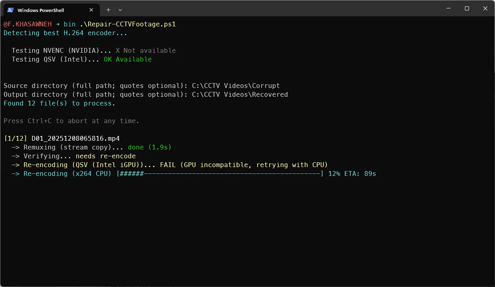
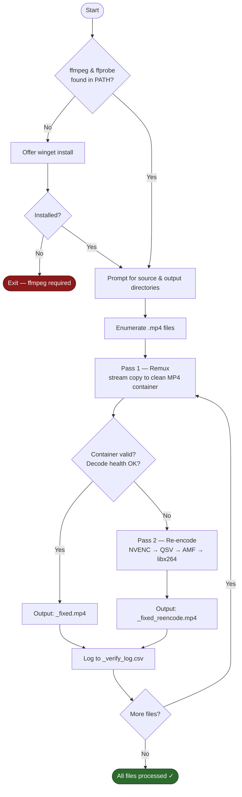

# Repair-VideoFiles

<!-- BADGES:START -->
[](LICENSE) [](https://learn.microsoft.com/en-us/powershell/) [](https://www.microsoft.com/windows) [](https://github.com/5a9awneh/Repair-VideoFiles/commits/main) [](https://github.com/5a9awneh/Repair-VideoFiles)
<!-- BADGES:END -->

Repairs corrupted or timestamp-broken MP4 files — common with CCTV incident exports and bad trim operations. Remuxes, verifies, and re-encodes with automatic GPU selection, then logs every result to a CSV.

**Script running — encoder detection, per-file remux/verify/re-encode:**





---

## 📋 Requirements

- Windows 10 / 11
- PowerShell 5.1 or later (built-in)
- **ffmpeg + ffprobe** — the script detects these in your PATH automatically. If not found, it offers to install via winget:
  ```
  winget install -e --id Gyan.FFmpeg
  ```
  winget handles its own UAC prompt. No admin rights required to run the script itself.

---

## 🚀 Usage

**Option A — double-click:**
```
RUN.bat
```

**Option B — PowerShell directly:**
```powershell
.\Repair-VideoFiles.ps1
```

The script prompts for two paths:

1. **Source directory** — folder containing the original `.mp4` files to repair
2. **Output directory** — where repaired files and the processing log will be written

Any user-accessible path works: under your user profile (`%USERPROFILE%\...`), a second partition (`D:\`), an external USB/SSD, or a mapped network drive (`Z:\`). Quotes are optional.

> **Note:** For the **output directory**, avoid paths directly under the system drive root (e.g. `C:\Output`) — standard users can't create folders or write files there without admin rights. The source directory is read-only access and works fine anywhere. Use a path under your user profile or a non-system drive for output.

---

## 🔧 How It Works

Each input file goes through up to two passes:

| Pass | What happens |
|------|-------------|
| **Pass 1 — Remux** | Stream-copies the primary video stream into a fresh MP4 container with regenerated timestamps. Fast, lossless. |
| **Verify** | Runs ffprobe (container check) and a 30-second ffmpeg decode health check. If both pass, done. |
| **Pass 2 — Re-encode** | Only triggered when verification fails. Re-encodes to H.264 with automatic encoder selection: NVENC (NVIDIA) → QSV (Intel) → AMF (AMD) → libx264 CPU fallback. |

---

## 📁 Output Files

| File | Description |
|------|-------------|
| `<name>_fixed.mp4` | Remux-only output (produced for every input) |
| `<name>_fixed_reencode.mp4` | Re-encoded output (only when remux verification fails) |
| `_verify_log.csv` | Full processing log — input, output, status, action, decode severity, encoder used, details |

> Use the `output` column in `_verify_log.csv` as the authoritative list of final deliverables. Both `_fixed.mp4` and `_fixed_reencode.mp4` may exist for the same input; the log tells you which one passed verification.

---

## ⚠️ Notes & Limitations

- Only the **primary video stream** is preserved — audio is intentionally dropped (`-an`). This is by design for CCTV footage, which is typically silent or has irrelevant audio.
- Re-encode uses a fixed quality target (CRF 23 / QP 23). Adjust in the script if needed.
- Remux has a hard timeout cap (90s) and stall detection (15s no output growth) to handle frozen ffmpeg processes on severely corrupted files.

---

## 📄 License

MIT — see [LICENSE](LICENSE).
